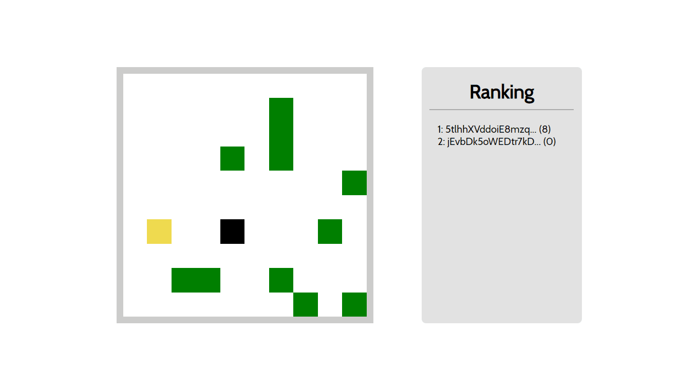

<h1 align="center">
    Multiplayer Square Game
</h1>

<p align="center">Simple, yet insightful game developed as a way to learn and practice critical concepts regarding to software architecture and software development.</p>

<p align="center">

<a href="https://github.com/diego-aquino">

</a>


<a>

</a>

<a href="./LICENSE">

</a>

</p>

<p align="center">
<a href="#rocket-features">Features</a>&nbsp;&nbsp;&nbsp;|&nbsp;&nbsp;&nbsp;
<a href="#gear-technologies">Technologies</a>&nbsp;&nbsp;&nbsp;|&nbsp;&nbsp;&nbsp;
<a href="#computer-getting-started">Getting started</a>&nbsp;&nbsp;&nbsp;|&nbsp;&nbsp;&nbsp;
<a href="#newspaper_roll-license">License</a>&nbsp;&nbsp;&nbsp;|&nbsp;&nbsp;&nbsp;
<a href="#handshake-acknowledgments">Acknowledgments</a>
</p>

<!--  -->

## :rocket: Features

- Player movements across the playable area
- Random fruit generation
- Multiplayer mode support (using [socket.io](https://github.com/socketio/socket.io))
- Point reward by collecting fruits *[In development...]*
- Realtime player ranking *[In development...]*

## :gear: Technologies

This project was developed with the following technologies:

- [JavaScript](https://developer.mozilla.org/en-US/docs/Web/JavaScript)
- [Node.js](https://nodejs.org/en/) + [Express](https://expressjs.com/), [Nodemon](https://www.npmjs.com/package/nodemon) and [Socket.io](https://github.com/socketio/socket.io)
- [HTML](https://developer.mozilla.org/en-US/docs/Web/HTML)
- [VS Code](https://code.visualstudio.com/)
<!-- - [ScreenToGif](https://www.screentogif.com/), used for recording demonstration GIFs. -->

## :computer: Getting started

To clone and run this application, you'll need [Git](https://git-scm.com/) and [Node.js](https://nodejs.org/en/) installed on your computer. Then, from your command line:

```bash
# clone this repository
$ git clone https://github.com/diego-aquino/multiplayer-square-game.git

# go to the created directory
$ cd multiplayer-square-game/

# install required dependencies
$ npm install

# start the application server
$ node server.js
```
```bash
# if you have nodemon globally installed, you can replace the last command by
$ npm start
```

Now you can visit `http://localhost:3000` to play the game!

## :newspaper_roll: License

This project if under MIT License. Check [LICENSE](./LICENSE) for more information.

## :handshake: Acknowledgments

Especial thanks to [@filipedeschamps](https://github.com/filipedeschamps) for creating a tutorial for this project and turning it into an amazing journey, as well as sharing his learnings, in the ["Meu Primeiro Jogo Multiplayer" playlist](https://www.youtube.com/playlist?list=PLMdYygf53DP5SVQQrkKCVWDS0TwYLVitL) on YouTube. If you want to see his original repository, [click here](https://github.com/filipedeschamps/meu-primeiro-jogo-multiplayer).

---

Made by [Diego Aquino](https://github.com/diego-aquino/) :sunglasses:. [Connect with me!](https://www.linkedin.com/in/diego-aquino) :wave:
